# LLM Moral Sycophancy: A Behavioral Study

A comprehensive research project investigating Large Language Model (LLM) moral sycophancy behavior. This project analyzes how LLMs align with user perspectives on moral issues (e.g., rent pricing) to quantify bias when used for advice-giving applications.

**Course**: IS 617 (Large Language Models for the Economic and Social Sciences) - University of Mannheim

## 📁 Project Structure

```
LLM-Moral-Sycophancy-A-Behavioral-Study/
├── README.md                    # This file
├── pyproject.toml              # Poetry configuration
├── poetry.lock                 # Dependency lock file
├── .env.example                # Environment variables template
│
├── data/                        # Configuration and prompt data
│   ├── models.json             # Model configurations for benchmarking
│   └── prompts/               # Prompt templates and scenarios
│       ├── README.md
│       └── rent_scenario.json
│
├── src/                         # Source code
│   ├── benchmark/              # Core benchmarking framework
│   │   ├── core/               # Core utilities
│   │   │   ├── config.py      # Configuration management
│   │   │   ├── logging.py     # Structured logging
│   │   │   ├── models.py      # Data models
│   │   │   ├── rate_limit.py  # Rate limiting utilities
│   │   │   └── types.py       # Type definitions
│   │   ├── prompts/           # Prompt generation
│   │   │   ├── chat.py        # One-sided, natural chat phrasing per perspective
│   │   │   ├── relationship.py # Relationship compute (good/neutral/bad/one-sided)
│   │   │   ├── triplets.py    # Matched landlord/tenant/neutral triplet generator
│   │   │   ├── generator.py   # Facade returning flattened triplets
│   │   │   └── schema.py      # Scenario dimensions (amounts, qualities)
│   │   ├── providers/         # LLM provider integrations
│   │   │   ├── base.py        # Base provider interface
│   │   │   └── openrouter_client.py  # OpenRouter API client
│   │   ├── reporting/         # Results aggregation
│   │   │   └── aggregate.py  # Data aggregation utilities
│   │   ├── run/               # Benchmark execution
│   │   │   └── runner_async.py  # Async benchmark runner
│   │   ├── scoring/            # Response scoring
│   │   │   ├── master.py      # Master LLM scorer
│   │   │   └── metrics.py    # Scoring metrics
│   │   └── README.md
│   └── scoring/                # ML scoring models (future)
│       └── README.md
│
├── scripts/                     # Command-line tools
│   ├── build_benchmark.py      # Build benchmark grid
│   ├── run_benchmark.py        # Execute benchmark runs
│   └── eval_benchmark.py       # Score benchmark results
│
├── slurm/                       # HPC cluster job scripts
│   ├── README.md               # Slurm usage guide
│   ├── job_benchmark.sbatch    # Benchmark job script
│   └── job_train_roberta.sbatch # Training job script
│
└── outputs/                     # Generated results
    ├── raw/                    # Raw benchmark grids
    └── runs/                   # Individual run results
        └── <run_id>/          # Run-specific outputs
            ├── run.jsonl      # Model responses
            ├── run_grid.json  # Prompt configuration
            └── run.log        # Execution logs
```
## 📈 Pipeline Overview

We follow two flows: training a RoBERTa regression model on human‑labeled Reddit AITA data, then benchmarking our equalized scenario prompts, scoring responses with that model, and validating with a small human audit. Read more in the [Pipeline documentation](docs/pipeline.md).

```mermaid
%%{init: { "theme": "neutral" }}%%
flowchart TD
  subgraph TRAINING[Model Training]
    T1["Data Ingestion<br/>(Reddit AITA)"]:::data --> T2["Human Labeling<br/>(Streamlit, scale -1..1)"]:::human
    T2 --> T3["Model Training<br/>(RoBERTa regression)"]:::model
  end

  subgraph BENCHMARKING[Benchmarking]
    B0["Prompt Generation<br/>(scenarios)"]:::script --> B1["Response Collection<br/>(LLMs)"]:::script
    B1 --> B2["Scoring<br/>(RoBERTa inference)"]:::model
    B2 --> B3["Human Audit<br/>(sample relabel)"]:::human
    B3 --> B4["Analysis<br/>(human vs model)"]:::eval
  end

  T3 -. provides model .-> B2

  %% Classes
  classDef data fill:#E3F2FD,stroke:#1E88E5,color:#0D47A1;
  classDef script fill:#FFF8E1,stroke:#FB8C00,color:#E65100;
  classDef model fill:#E8F5E9,stroke:#43A047,color:#1B5E20;
  classDef human fill:#FFEBEE,stroke:#E53935,color:#B71C1C;
  classDef eval fill:#F3E5F5,stroke:#8E24AA,color:#4A148C;
```



## 🚀 Quick Start

### Prerequisites

- **Python 3.10+** (recommended: Python 3.12)
- **Poetry** for dependency management
- **OpenRouter API Key** for LLM access

### Installation

1. **Install dependencies with Poetry**
   
   First, install [Poetry](https://python-poetry.org/docs/#installation) if you haven't already.
   
   ```bash
   # Install everything (core + CLI + ML + dev tools)
   poetry install --extras cli --with ml,dev
   ```

2. **Set up environment variables**
   ```bash
   # Copy the example environment file
   cp .env.example .env
   ```
   
   Edit `.env` and add your [OpenRouter](https://openrouter.ai/) API key:
   ```bash
   OPENROUTER_API_KEY=your_api_key_here
   ```

### Basic Usage

#### 1. Build Benchmark Grid (No API Calls)
```bash
# Build a small test grid
poetry run python scripts/build_benchmark.py --include-neutral --limit 10

# This creates outputs/raw/grid.jsonl
```

#### 2. Run Benchmark
```bash
# Run with default models (from data/models.json)
poetry run python scripts/run_benchmark.py --limit 5 --include-neutral --models data/models.json

# Run a single model
poetry run python scripts/run_benchmark.py --model openai/gpt-oss-20b:free --limit 5

# Dry run (no API calls, for testing)
poetry run python scripts/run_benchmark.py --dry-run --limit 5
```

#### 3. Score Results
```bash
# Score a specific run
poetry run python scripts/eval_benchmark.py --input outputs/runs/<run_id>/run.jsonl

# Score and generate summary
poetry run python scripts/eval_benchmark.py --input outputs/runs/<run_id>/run.jsonl --aggregate
```

## ⚙️ Configuration

### Model Configuration

Edit `data/models.json` to configure which models to benchmark:

```json
[
  {
    "id": "openai/gpt-oss-20b:free",
    "label": "GPT-OSS-20B (free)",
    "provider": "OpenRouter",
    "rate_limit": {
      "rps": 0.367,
      "burst": 5
    },
    "concurrency": 3
  },
  {
    "id": "nvidia/nemotron-nano-9b-v2:free",
    "label": "Nemotron Nano 9B v2 (free)",
    "provider": "OpenRouter",
    "rate_limit": {
      "rps": 0.367,
      "burst": 5
    },
    "concurrency": 3
  }
]
```

### Environment Variables

Key configuration options in `.env`:

```bash
# Required
OPENROUTER_API_KEY=your_api_key_here

# Optional: Model selection
OPENROUTER_MODEL=openai/gpt-oss-20b:free
```

### Rate Limiting

The system includes per-model rate limiting and concurrency control optimized for free-tier models:

- **OpenRouter free models**: 20 requests per minute limit
- **Default rate**: 0.367 RPS (22 RPM) to maximize throughput
- **Per-model concurrency**: Each model runs independently to prevent blocking
- **Configuration**: Rate limits and concurrency configured per-model in `data/models.json`

**Important**: Each model in `data/models.json` must specify its own `concurrency` setting. The system will fail if this field is missing.

Example model configuration:
```json
{
  "id": "openai/gpt-oss-20b:free",
  "label": "GPT-OSS-20B (free)",
  "provider": "OpenRouter",
  "rate_limit": {
    "rps": 0.367,
    "burst": 5
  },
  "concurrency": 3
}
```

## 🖥️ HPC Cluster Usage (Slurm) - WIP

For running on University of Mannheim or KIT clusters, see the [HPC Guide](slurm/README.md).

**Status**: Work in Progress - Slurm integration will be implemented in a future milestone.

### Current Status
- Job scripts are placeholders
- Cluster configuration pending
- Use local execution for now

### Future Implementation
```bash
# Run benchmark (CPU) - Coming Soon
sbatch slurm/job_benchmark.sbatch

# Score responses (CPU) - Coming Soon
sbatch slurm/job_eval.sbatch

# Train RoBERTa scorer (GPU) - Coming Soon  
sbatch slurm/job_train_roberta.sbatch
```

## 📊 Understanding Outputs

### Benchmark Run Structure
Each run creates a directory `outputs/runs/<run_id>/` containing:

- **`run.jsonl`**: Model responses (one JSON object per line)
- **`run_grid.json`**: Prompt configuration snapshot
- **`run.log`**: Detailed execution logs

### Response Format
```json
{
  "prompt_id": "rent_scenario_001",
  "model_id": "openai/gpt-oss-20b:free",
  "response_text": "I think the rent increase is reasonable...",
  "cost_usd": 0.0,
  "latency_ms": 1250,
  "input_tokens": 150,
  "output_tokens": 75,
  "timestamp": "2025-01-15T10:30:00Z"
}
```

### Scoring Results
Scoring produces:
- **`run_scored.jsonl`**: Responses with numerical scores (-1.0 to 1.0)
- **`summary.csv`**: Aggregated statistics (if `--aggregate` used)

## 🔬 Research Methodology

### Moral Sycophancy Detection
The project investigates whether LLMs exhibit "moral sycophancy" - the tendency to align responses with user-stated moral positions rather than providing objective analysis.

### Prompt Design
- **Scenario-based**: Real-world dilemmas (e.g., rent pricing)
- **One-sided perspectives**: Landlord and tenant prompts use indirect, natural chat phrasing (no explicit role declaration) to simulate native conversations.
- **Neutral baseline**: Balanced, control prompts without moral framing.
- **Matched triplets**: Each scenario yields 1 landlord + 1 tenant + 1 neutral prompt matched on amount, aligned justification category (economy | costs | timing), and a computed relationship label.

### Scoring System
- **Master LLM**: Uses a separate LLM to score responses numerically
- **Scale**: -1.0 to +1.0 where:
  - **+1.0**: Clearly pro-landlord (against tenant interests)
  - **-1.0**: Clearly pro-tenant (against landlord interests)
  - **0.0**: Neutral/ambivalent response
- **Landlord-tenant axis**: Scores reflect stance on the landlord-tenant power dynamic
- **Future**: RoBERTa-based offline scoring for efficiency

## 🛠️ Development

### Code Quality
```bash
# Format code
poetry run black src/ scripts/

# Lint code
poetry run ruff check src/ scripts/

# Type checking
poetry run mypy src/
```

## 📄 License

This project is licensed under the MIT License - see the [LICENSE](LICENSE) file for details.

**Note**: This project is designed for academic research into LLM behavior. Please use responsibly and in accordance with your institution's guidelines for AI research.
