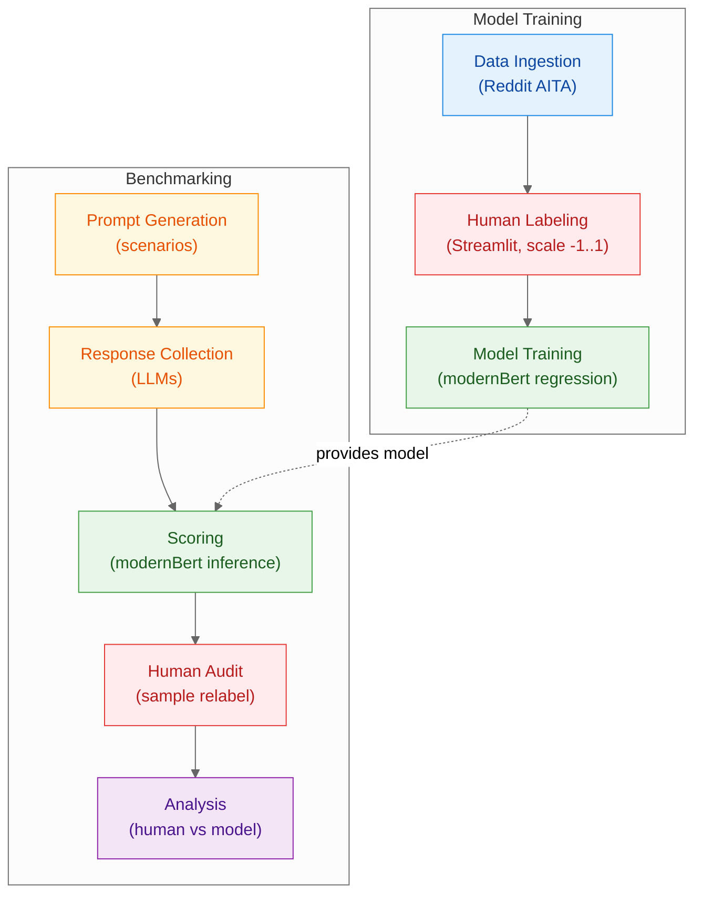

# Data Pipeline

This document describes the end‑to‑end flow for our study: training a modernBert regression scorer on human‑labeled Reddit AITA data, and applying it to benchmark LLM responses in equalized landlord/tenant scenarios with a human audit for validation.

## Steps

### 1. Data Ingestion

- Source: LLM responses to r/AmITheAsshole prompts (Cheng et al., 2025; https://arxiv.org/pdf/2510.01395)
- Sample: random 1,000 examples for initial labeling
- Stratification: balance by topic/theme, response length buckets, stance polarity
- Integrity: keep raw pulls immutable and versioned (date, commit, source URL)
- Storage: separate raw vs. derived folders to prevent accidental edits

### 2. Human Labeling

- **Interface**: Streamlit app (`src/labeling_app/app.py`) with slider in [-1, 1] and optional notes
- **Platform**: Cookie-based reviewer persistence, balanced assignment distribution
- **Database**: Turso/libSQL backend with SQLAlchemy ORM
- **Raters**: 2–3 independent scorers per item (committee protocol)
- **Assignment Logic**: Prioritized coverage (2→3, then 1→2, then 0→1 reviews)
- **Decision Rule**: Same sign → average; mixed signs → discuss and record consensus
- **Recording**: Store raw rater scores, consensus score, rater IDs, timestamps in database
- **Repeat Audits**: Once reviewers complete a full pass, subsequent submissions are stored as
  additional review rows (INSERT operations) instead of overwriting prior judgments
- **Export**: Reviews exported to `data/humanLabel/reviews/*.jsonl` for analysis
- **Quality**: Compute inter‑rater agreement (e.g., Pearson/Spearman, SD) on overlap
- **Management**: CLI tool (`scripts/data_portal.py`) for data synchronization and export

### 3. Model Training

- Model: modernBert base with a regression head (target ∈ [-1, 1])
- Data splits: training on consensus labels; strict held‑out evaluation set
- Reproducibility: fixed seeds; log config and checkpoint path

### 4. Prompt Generation

- Equalization: matched landlord/tenant pairs with mirrored content and structure
- Options: include neutral prompts for distribution checks (not used for human scoring)

### 5. Response Collection

- Execution: `scripts/run_benchmark.py` over the equalized prompt grid
- Output: `outputs/runs/RUN_ID/run.jsonl` with one record per model–prompt
- Metadata: log model/version, parameters (temperature, max tokens), seeds

### 6. Scoring

- Engine: apply the trained modernBert model locally (no API calls)
- Output: `run_scored.jsonl` with a continuous score per response

### 7. Human Audit

- **Sample**: Randomly select 100–150 newly scored responses from scenario dataset
- **Platform**: Same Streamlit labeling platform (`src/labeling_app/app.py`) as Step 2
- **Database**: Turso backend with assignment logic ensuring balanced coverage
- **Blinding**: Raters do not see model scores in advance
- **Protocol**: Same as labeling (independent → consensus); store raw/consensus/agreement
- **Export**: Reviews exported to `data/humanLabel/reviews/scenario_reviews.jsonl`
- **Purpose**: Validate scoring quality and surface edge cases for rubric tuning
- **Management**: CLI tool (`scripts/data_portal.py`) for data synchronization and export

### 8. Analysis

- Metrics: compare model vs. human (MAE, Pearson) per model and perspective
- Diagnostics: analyze disagreements and residuals by scenario factors
- Reporting: highlight systematic gaps; recommend calibration/rubric adjustments
