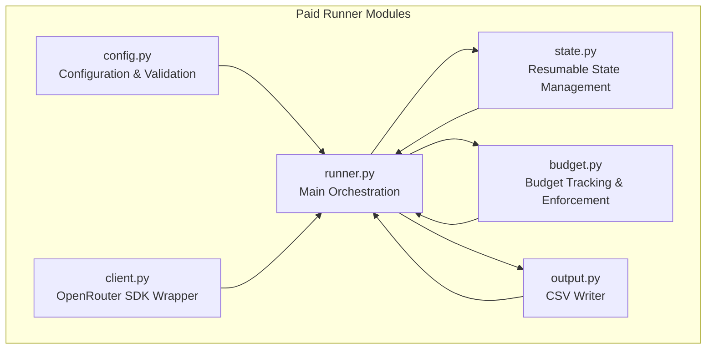

# Paid Runner for OpenRouter

Cost-aware benchmark runner that processes prompts through multiple OpenRouter models with budget tracking, synchronized retries, and resumable state management.

## Purpose

Process prompts from seed files (e.g., `aita_prompt_seed.jsonl`) through multiple OpenRouter models (default: 15 models) sequentially, with strict budget enforcement and the ability to resume runs when additional funds become available.

## Architecture



## Main Workflow

```mermaid
flowchart TD
    Start([Start: run_paid_benchmark]) --> LoadConfig[Load Configuration<br/>API Key, Models, Budget, Seed File]
    LoadConfig --> ComputeHash[Compute Seed File Hash<br/>SHA1 for stable run folder]
    ComputeHash --> InitState[Initialize State Manager<br/>state.json path]
    InitState --> LoadState{State File<br/>Exists?}
    LoadState -->|Yes| ResumeState[Load Existing State<br/>Resume from last position]
    LoadState -->|No| NewState[Create New State<br/>started_at, total_cost=0]
    ResumeState --> InitBudget[Initialize Budget Tracker<br/>limit, current=state.total_cost]
    NewState --> InitBudget
    InitBudget --> InitClient[Initialize OpenRouter Client<br/>API key, timeout]
    InitClient --> InitCSV[Initialize CSV Writer<br/>results.csv, append if resuming]
    InitCSV --> GetPrompts[Get Next Prompts<br/>with Missing Models]
    GetPrompts --> CountPrompts[Count Total Missing Runs<br/>Sum missing models per prompt]
    CountPrompts --> CheckPromptLimit{Prompt Limit<br/>Set?}
    CheckPromptLimit -->|Yes| CountExisting[Count Existing<br/>Completed Prompts]
    CheckPromptLimit -->|No| LoopPrompts[Loop Through Prompts]
    CountExisting --> CalcTarget[Calculate Target<br/>existing + limit]
    CalcTarget --> LoopPrompts
    LoopPrompts --> CheckBudgetBefore{Budget<br/>Exceeded?}
    CheckBudgetBefore -->|Yes| StopBudget[Stop: Budget Exceeded<br/>Save State]
    CheckBudgetBefore -->|No| GetMissing[Get Missing Models<br/>for Current Prompt]
    GetMissing --> ProcessPrompt[Process Prompt<br/>process_prompt_synchronized]
    ProcessPrompt --> WriteCSV[Write Results to CSV<br/>All model results]
    WriteCSV --> UpdateState[Update State<br/>Mark models complete]
    UpdateState --> CheckComplete{All Models<br/>Complete?}
    CheckComplete -->|No| LogPartial[Log: Partial Complete<br/>Remaining models]
    CheckComplete -->|Yes| LogComplete[Log: Prompt Complete<br/>All models done]
    LogComplete --> CheckPromptLimit2{Prompt Limit<br/>Reached?}
    CheckPromptLimit2 -->|Yes| StopLimit[Stop: Prompt Limit Reached<br/>Save State]
    CheckPromptLimit2 -->|No| LogPartial
    LogPartial --> SaveState[Save State After Prompt<br/>state.json updated]
    SaveState --> CheckBudgetAfter{Budget<br/>Exceeded?}
    CheckBudgetAfter -->|Yes| StopBudget
    CheckBudgetAfter -->|No| MorePrompts{More<br/>Prompts?}
    MorePrompts -->|Yes| LoopPrompts
    MorePrompts -->|No| FinalSummary[Final Summary<br/>Total cost, prompts, models]
    StopBudget --> FinalSummary
    StopLimit --> FinalSummary
    FinalSummary --> CloseCSV[Close CSV Writer]
    CloseCSV --> FinalSave[Final State Save]
    FinalSave --> End([End: Return Summary])
    
    style Start fill:#e1f5e1
    style End fill:#ffe1e1
    style StopBudget fill:#ffe1e1
    style StopLimit fill:#ffe1e1
    style CheckBudgetBefore fill:#fff4e1
    style CheckBudgetAfter fill:#fff4e1
    style ProcessPrompt fill:#e1f0ff
```



## Key Features

- **Budget Enforcement**: Stops before exceeding budget limit, saves partial results
- **Synchronized Retries**: All models wait together if any model fails (via `asyncio.Event`)
- **Resumable State**: Save progress after each prompt, resume with more budget
- **CSV Output**: All results written to CSV with cost, tokens, latency metadata
- **OpenRouter SDK**: Uses official `openrouter` Python package
- **Smart Routing**: Only processes missing models per prompt, avoids duplicate work

## Configuration

| Item | Location | Notes |
|------|----------|-------|
| **API Key** | `.env` → `PAID_OPENROUTER_API_KEY` (or `OPENROUTER_API_KEY`) | Required. Get from https://openrouter.ai/keys. `PAID_OPENROUTER_API_KEY` is recommended for separate budget tracking |
| **Models** | `--models` CLI argument (optional) | Variable number of models, comma-separated. **Default**: 15 models covering major providers (see `SOTA_MODELS.md` for full list). You can specify any number of models. **Note**: `openai/gpt-5` and `openai/gpt-4o` are not in the default list as we already have data for them. |
| **Budget Limit** | `--budget` CLI argument (optional) | Maximum spending in USD. **Default**: `10.0` ($10) |
| **Seed File** | `--seed-file` (optional) | Path to JSONL file with prompts (default: `data/humanLabel/seeds/aita_prompt_seed.jsonl`) |
| **Output Directory** | `--output-dir` (optional) | Where to save CSV and state (default: `outputs/paid_runs/`) |
| **Max Retries** | `--max-retries` (optional) | Maximum retries per model (default: 10) |
| **Request Timeout** | `--request-timeout` (optional) | Request timeout in seconds (default: 60) |

### Model Selection

Models are specified via the `--models` argument as a comma-separated list of model IDs. Model IDs follow OpenRouter's format. The default configuration includes 15 models covering major providers:

- Anthropic: `anthropic/claude-opus-4.5`, `anthropic/claude-sonnet-4.5`, `anthropic/claude-sonnet-4`
- Google: `google/gemini-3-pro-preview`, `google/gemini-2.5-pro`, `google/gemini-2.5-flash`
- OpenAI: `openai/gpt-5.1`, `openai/gpt-oss-120b`
- Amazon: `amazon/nova-premier-v1`
- AllenAI: `allenai/olmo-3-32b-think`
- xAI: `x-ai/grok-4.1-fast:free`
- Chinese Models: `moonshotai/kimi-k2-thinking`, `deepseek/deepseek-r1`, `qwen/qwen3-max`
- European: `mistralai/mistral-medium-3.1`

**Note**: `openai/gpt-5` and `openai/gpt-4o` are not included in the default list as we already have comprehensive data for these models. They can be added manually if needed.

See [SOTA_MODELS.md](SOTA_MODELS.md) for detailed model selection rationale and [OpenRouter Models](https://openrouter.ai/models) for the full list of available models and their pricing.

### Budget Management

The budget limit is specified in USD via the `--budget` argument. The runner:

1. **Checks budget before each API call** - Prevents exceeding limit
2. **Stops immediately when limit would be exceeded** - Saves partial results
3. **Tracks cumulative spending** - Updates state after each successful call
4. **Allows resumption** - Add more budget and resume from saved state

Example: If you set `--budget 10.0` and have spent $9.50, the runner will stop before making any call that would exceed $10.00.

## Usage

### Basic Usage

```bash
# Install dependencies (if not already installed)
poetry install

# Set API key in .env file (see .env.example)
# Add PAID_OPENROUTER_API_KEY=your_key_here to .env

# Run with default settings (15 models, $10 budget)
# Just run the script - no arguments needed!
poetry run python scripts/run_paid_benchmark.py

# Or with custom models and budget
poetry run python scripts/run_paid_benchmark.py \
  --models anthropic/claude-opus-4.5,google/gemini-3-pro-preview,openai/gpt-5.1,amazon/nova-premier-v1,allenai/olmo-3-32b-think \
  --budget 20.0
```

### Resuming a Run

If a run stops due to budget limits or interruption, you can resume it:

```bash
# Resume with additional budget
poetry run python scripts/run_paid_benchmark.py \
  --models ... --budget 20.0 \
  --resume
```

The runner automatically detects existing state files and resumes from the last completed prompt. You can increase the budget to continue processing.

### Custom Configuration

```bash
# Use custom seed file and output directory
poetry run python scripts/run_paid_benchmark.py \
  --models ... --budget 10.0 \
  --seed-file data/humanLabel/seeds/custom_seed.jsonl \
  --output-dir outputs/custom_runs/ \
  --max-retries 5 \
  --request-timeout 120
```

## Output Format

Results are written to `output_dir/results.csv` with the following columns:

- `prompt_identifier` - Prompt ID from seed file
- `prompt_body` - Full prompt text
- `model_id` - Model used
- `response_text` - Model response
- `input_tokens` - Input tokens used
- `output_tokens` - Output tokens used
- `total_tokens` - Total tokens
- `cost_usd` - Cost in USD
- `latency_ms` - Request latency in milliseconds
- `timestamp` - ISO timestamp
- `error` - Error message if failed
- `retry_count` - Number of retries needed

State is saved to `output_dir/state.json` and includes:
- Completed prompts and models
- Total cost spent
- Last processed prompt
- Timestamps

## Integration with Existing Benchmark

The paid runner is separate from the main benchmark runner (`src/benchmark/run/runner_async.py`) but shares:

- **Retry logic**: Uses `src/benchmark/core/retry.py` for consistent error handling
- **Logging**: Uses `src/benchmark/core/logging.py` for structured logging
- **Types**: Compatible with `src/benchmark/core/types.py` if needed

The paid runner is designed specifically for:
- **Cost-sensitive runs** - When you need strict budget control
- **OpenRouter-only** - Uses OpenRouter SDK directly (not LiteLLM)
- **Resumable processing** - Essential when working with limited budgets
