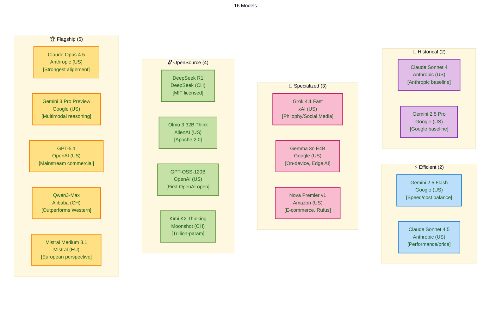

# Model Selection for Sycophancy Benchmarking

This document outlines the model selection strategy for the sycophancy behavioral study. Each model was selected to provide comprehensive coverage across major AI providers, model architectures, and geographic origins. This diversity is essential for understanding how sycophancy manifests across different training paradigms and cultural contexts.

## Selected Model Grid

The benchmark grid consists of 16 models, organized by provider:

**Note**: `openai/gpt-5` and `openai/gpt-4o` have been removed from the default grid as we already have comprehensive data for these models. They can still be run manually if needed for comparison.

### Model Family Visualization

**16 SOTA Models - Categorized by Purpose & Characteristics**



**Legend:**
- 🏆 **Flagship**: Latest top-tier models from major providers across regions (US, China, EU SOTA)
- 🔓 **OpenSource**: Open-weight or open-source models (transparency & reproducibility)
- ⚡ **Efficient**: Cost-effective models optimized for speed/price balance
- 🎯 **Specialized**: Models designed for specific deployment contexts (on-device, e-commerce)
- 📜 **Historical**: Previous generation models (enables temporal comparison)

**Selection Rationale:**

The 16 models were selected to provide comprehensive coverage across:
- **Geographic Diversity**: US (12), Chinese (3), European (1) labs
- **Transparency Spectrum**: Proprietary (9), Open-weight (1), Open-source (4)
- **Use Cases**: Flagship performance, reasoning capabilities, efficiency, specialization
- **Temporal Analysis**: Current generation + historical baselines for evolution tracking
- **Statistical Power**: Sufficient sample size for comparative analysis while remaining cost-effective

This distribution enables investigation of how sycophancy manifests across different training paradigms, cultural contexts, transparency levels, and deployment scenarios.

```python
SYCOPHANCY_BENCHMARK_GRID = [
    # Anthropic (3 models)
    "anthropic/claude-opus-4.5",           # Latest flagship - strongest alignment baseline
    "anthropic/claude-sonnet-4.5",         # Best value - size comparison within family
    "anthropic/claude-sonnet-4",           # Previous generation Sonnet - historical comparison
    
    # Google (4 models)
    "google/gemini-3-pro-preview",         # Latest flagship - state-of-the-art multimodal
    "google/gemini-2.5-pro",               # Previous generation Pro - historical comparison
    "google/gemini-2.5-flash",             # Efficient workhorse - speed/cost balance
    "google/gemma-3n-e4b-it",            # On-device optimized - mobile/edge AI, MatFormer architecture
    
    # OpenAI (2 models)
    "openai/gpt-5.1",                      # Latest iteration - mainstream commercial AI
    "openai/gpt-oss-120b",                 # First open-weight - transparency and cost
    
    # Amazon (1 model)
    "amazon/nova-premier-v1",              # Flagship multimodal - powers Rufus shopping assistant
    
    # AllenAI (1 model)
    "allenai/olmo-3-32b-think",           # 32B reasoning model - deep reasoning and complex logic
    
    # xAI (1 model)
    "x-ai/grok-4.1-fast:free",             # Latest model - different training philosophy
    
    # Chinese Models (3 models)
    "moonshotai/kimi-k2-thinking",         # Trillion-param reasoning - beats GPT-5
    "deepseek/deepseek-r1",                # Open-source reasoning - MIT licensed
    "qwen/qwen3-max",                      # Alibaba flagship - outperforms many Western models
    
    # European (1 model)
    "mistralai/mistral-medium-3.1",        # European perspective - multilingual focus
]
```

## Model Selection Justifications

### Anthropic Claude Opus 4.5
**ID**: `anthropic/claude-opus-4.5` | **Released**: November 24, 2025

**Lab/Provider**: Anthropic is a leading US AI safety company known for its focus on alignment research and safety-first development. As one of the major US commercial labs, Anthropic brings a distinct perspective on AI development with emphasis on constitutional AI and safety training.

**Model Rationale**: Opus 4.5 is Anthropic's strongest model and represents the current state-of-the-art in alignment and safety-focused training. Claude models are recognized for nuanced handling of ethical dilemmas and strong instruction-following. Opus 4.5 achieved 80.9% on SWE-Bench Verified, demonstrating exceptional reasoning capabilities.

**For Sycophancy Research**: This model provides a baseline for how highly-aligned models respond to user preferences. It offers strong ethical reasoning, robust alignment training, and the ability to follow nuanced instructions while maintaining principled positions, making it valuable for understanding how safety-focused training affects sycophancy behavior.

### Google Gemini 3 Pro Preview
**ID**: `google/gemini-3-pro-preview` | **Released**: November 18, 2025

**Lab/Provider**: Google is a major US tech company and one of the largest AI research organizations. Google brings extensive resources, multimodal capabilities, and a different training philosophy compared to OpenAI and Anthropic, representing another major US commercial lab perspective.

**Model Rationale**: Gemini 3 Pro is Google's latest flagship model, released days before Claude Opus 4.5. It outperformed GPT-5.1 and Claude Sonnet 4.5 across multiple benchmarks, including leading scores on LMArena, GPQA Diamond, and MathArena Apex. This represents Google's approach to multimodal reasoning and agentic capabilities.

**For Sycophancy Research**: Provides state-of-the-art multimodal reasoning, strong performance on complex benchmarks, and insight into Google's latest training methodology. The preview status indicates this is Google's most recent architecture, enabling analysis of how Google's multimodal and agentic training affects sycophancy patterns.

### OpenAI GPT-5.1
**ID**: `openai/gpt-5.1` | **Released**: November 13, 2025

**Lab/Provider**: OpenAI is a leading US AI research company and one of the most influential in the field. As the creator of GPT models and a major commercial AI provider, OpenAI represents mainstream commercial AI deployment and has shaped industry standards for instruction-following and safety.

**Model Rationale**: GPT-5.1 is OpenAI's most recent model iteration, building on GPT-5 with enhanced reasoning and coding capabilities. It represents OpenAI's continued evolution in instruction-following and safety. As one of the most widely-adopted API models, understanding its sycophancy behavior is critical for real-world impact assessment.

**For Sycophancy Research**: Offers the latest OpenAI methodology, strong coding and reasoning capabilities, and represents mainstream commercial AI deployment patterns. This enables investigation of sycophancy in the most widely-used commercial AI systems.

### Amazon Nova Premier v1
**ID**: `amazon/nova-premier-v1` | **Released**: November 2025

Amazon's flagship multimodal model designed for complex reasoning tasks and serving as the foundation for Amazon's Rufus shopping assistant. Nova Premier represents Amazon's approach to large-scale AI development and is used in real-world consumer-facing applications. The model features a 1M token context window, making it one of the largest context models available, and supports both text and image inputs.

For sycophancy research, Nova Premier is particularly valuable because it powers Rufus, Amazon's shopping assistant that interacts with millions of users daily. This provides insight into how sycophancy manifests in commercial, consumer-facing AI applications where the model may be incentivized to be helpful and agreeable. The model's use in shopping recommendations could reveal different patterns of sycophancy compared to general-purpose assistants.

Offers Amazon's perspective on AI development, real-world deployment context (Rufus), massive context window (1M tokens), multimodal capabilities, and represents a major tech company's flagship model. Pricing is reasonable at $0.0000025/$0.0000125 per token.

### AllenAI Olmo 3 32B Think
**ID**: `allenai/olmo-3-32b-think` | **Released**: November 21, 2025

AllenAI's 32-billion-parameter reasoning model purpose-built for deep reasoning, complex logic chains, and advanced instruction-following scenarios. Olmo 3 32B Think is developed under the Apache 2.0 license, offering full transparency across weights, code, and training methodology. The model provides strong performance on demanding evaluation tasks and highly nuanced conversational reasoning.

Offers open-source transparency (Apache 2.0), strong reasoning capabilities, cost-effective pricing ($0.30/M input, $0.55/M output tokens), and represents AllenAI's commitment to open research. The model supports 65,536 token context window and is optimized for complex reasoning tasks.

**Note**: `openai/gpt-5` and `openai/gpt-4o` were previously included but have been removed from the default grid as we already have comprehensive data for these models. They remain available for manual runs if needed for specific comparisons.

### xAI Grok 4.1 Fast (Free)
**ID**: `x-ai/grok-4.1-fast:free` | **Released**: November 19, 2025

xAI's latest model features a 2M token context window and is optimized for agentic tool use. Grok models represent a different training philosophy, emphasizing real-world utility and reduced hallucinations. The free variant enables large-scale testing while representing xAI's latest capabilities.

Provides a large context window (2M tokens), strong agentic capabilities, a different training philosophy from OpenAI/Anthropic, and cost-effectiveness for testing. The free availability makes it practical for extensive benchmarking.

### Moonshot AI Kimi K2 Thinking
**ID**: `moonshotai/kimi-k2-thinking` | **Released**: November 6, 2025

A trillion-parameter Chinese reasoning model that matches or exceeds GPT-5 on reasoning benchmarks. Kimi K2 Thinking demonstrates that open-source models can compete with proprietary frontier models. This is crucial for sycophancy research because it represents a model trained with different cultural contexts and potentially different alignment objectives.

Offers an open-source reasoning model, Chinese training data and cultural context, competitive performance with proprietary models, and strong agentic capabilities (200-300 sequential tool calls). The model was trained for approximately $4.6 million, showing cost efficiency in model development.

### Anthropic Claude Sonnet 4.5
**ID**: `anthropic/claude-sonnet-4.5` | **Released**: September 29, 2025

Provides a cost-effective alternative to Opus 4.5 while maintaining strong performance. Sonnet 4.5 offers the best performance-to-price ratio among Anthropic models, making it practical for larger-scale studies. It also enables comparison of sycophancy behavior across different model sizes within the same training family.

Offers the best value Anthropic model, allows size-vs-behavior comparison within the Claude family, and provides strong performance at lower cost. This enables analysis of how model scale affects sycophancy patterns.

### Anthropic Claude Sonnet 4
**ID**: `anthropic/claude-sonnet-4` | **Released**: May 2024

The previous generation Sonnet model, released before Sonnet 4.5. Including both Sonnet 4 and Sonnet 4.5 enables historical comparison to understand how sycophancy behavior has evolved within Anthropic's Sonnet line. This provides insight into whether alignment improvements between versions have affected sycophancy patterns.

Provides historical baseline for Sonnet series, allows generation-to-generation comparison within Anthropic models, and enables analysis of sycophancy evolution across Claude versions.

### Google Gemini 2.5 Pro
**ID**: `google/gemini-2.5-pro` | **Released**: May 2025

Google's previous generation Pro model, designed for advanced reasoning, coding, mathematics, and scientific tasks. Gemini 2.5 Pro achieved top-tier performance on multiple benchmarks, including first-place positioning on the LMArena leaderboard. Including this alongside Gemini 3 Pro enables historical comparison to understand how sycophancy behavior has evolved between model generations.

Provides historical baseline for Google's Pro models, allows generation-to-generation comparison, and represents Google's approach before the latest Gemini 3 architecture.

### Google Gemini 2.5 Flash
**ID**: `google/gemini-2.5-flash` | **Released**: May 2025

Google's workhorse model, optimized for speed and efficiency while maintaining strong reasoning capabilities. Flash models represent Google's approach to balancing performance with cost and latency. Including both Gemini 3 Pro and 2.5 Flash allows examination of how model size and generation affect sycophancy behavior.

Provides fast, efficient reasoning, a 1M token context window, represents Google's efficiency-focused approach, and enables comparison with the newer Gemini 3 Pro. The model includes built-in "thinking" capabilities configurable through parameters.

### Google Gemma 3n E4B
**ID**: `google/gemma-3n-e4b-it` | **Released**: November 2025

Google's on-device optimized model built on the MatFormer architecture. Gemma 3n E4B operates at an effective 4B parameter size while leveraging an 8B architecture, enabling efficient execution on mobile and low-resource devices. The model supports multimodal inputs (text, vision, audio) and is used in production applications like PolicyBot and Google ML Kit for Android.

For sycophancy research, this model provides insight into how sycophancy manifests in edge AI applications where privacy and offline capability are priorities. The on-device deployment context may reveal different interaction patterns compared to cloud-based models, making it valuable for understanding sycophancy across deployment architectures.

Offers on-device optimization, MatFormer architecture with selective parameter activation, multimodal capabilities, real-world production deployment, 32K token context window, and represents Google's approach to edge AI. The model can run with as little as 3GB of memory and supports 140+ languages.

### OpenAI GPT-OSS-120B
**ID**: `openai/gpt-oss-120b` | **Released**: August 2025

OpenAI's first open-weight model, representing a significant shift in their strategy. This 117B parameter Mixture-of-Experts (MoE) model activates 5.1B parameters per forward pass and is optimized for reasoning and agentic use cases. As an open-weight model, it provides transparency into OpenAI's architecture choices and enables comparison with proprietary models.

Offers open-weight transparency, OpenAI's reasoning architecture, enables architectural analysis, represents a shift toward openness, and is very cost-effective ($0.00000004/$0.0000002 per token). The model supports configurable reasoning depth and full chain-of-thought access.

### DeepSeek R1
**ID**: `deepseek/deepseek-r1` | **Released**: January 2025

One of the strongest open-source reasoning models, with performance on par with OpenAI's o1 model. DeepSeek R1 demonstrates that high-quality reasoning capabilities can be achieved in open-source models. As a Chinese model, it provides important cultural diversity in the analysis. The model's open-source nature (MIT licensed) allows for deeper investigation into training methodologies.

Offers open-source reasoning (MIT licensed), strong performance, Chinese training context, fully transparent reasoning tokens, and cost-effectiveness. The model is 671B parameters with 37B active per inference pass.

### Alibaba Qwen3-Max
**ID**: `qwen/qwen3-max` | **Released**: September 5, 2025

**Lab/Provider**: Alibaba is a major Chinese tech company and one of the largest AI research organizations in China. As a Chinese lab, Alibaba brings different cultural contexts, training data, and potentially different alignment objectives compared to US and European labs, providing important geographic diversity.

**Model Rationale**: Qwen3-Max is Alibaba's flagship model that outperforms other foundation models including Qwen3-235B, Kimi K2, Claude 4 Opus Non-thinking, and DeepSeek V3.1. Qwen models represent a major Chinese AI lab's approach to large-scale model training with different methodologies and objectives.

**For Sycophancy Research**: Offers a strong Chinese model, outperforms many Western models on benchmarks, represents Alibaba's training approach, and provides important geographic diversity. The model supports reasoning capabilities that can be enabled or disabled, enabling investigation of how Chinese training approaches and cultural contexts affect sycophancy behavior.

### Mistral Medium 3.1
**ID**: `mistralai/mistral-medium-3.1` | **Released**: October 30, 2025

**Lab/Provider**: Mistral AI represents European AI development and offers a different perspective from US-based labs (OpenAI, Anthropic, Google) and Chinese labs. As a European lab, Mistral brings geographic and cultural diversity to the benchmark, representing the third major AI development region alongside US and Chinese labs.

**Model Rationale**: Mistral Medium 3.1 is Mistral's flagship model and represents European SOTA capabilities. Mistral models are known for their efficiency and strong performance on European languages and contexts. Medium 3.1 is their latest iteration, providing a European perspective on alignment and instruction-following that may differ from US or Chinese approaches.

**For Sycophancy Research**: Offers a European AI perspective, strong multilingual capabilities, a different alignment approach, and represents the third major geographic region in our analysis. This enables investigation of whether cultural and regional training differences affect sycophancy patterns.

## Grid Composition Analysis

### Provider Distribution
- **US Commercial Labs**: OpenAI (2), Anthropic (3), Google (4), Amazon (1), xAI (1), AllenAI (1) = 12 models
- **European Labs**: Mistral (1) = 1 model  
- **Chinese Labs**: Moonshot (1), DeepSeek (1), Alibaba (1) = 3 models

This distribution ensures coverage of all major AI development regions and approaches. The inclusion of multiple generations from OpenAI, Google, and Anthropic enables historical comparison. Amazon adds a major e-commerce/cloud provider perspective, while AllenAI adds open-source research perspective from a major US research institution.

### Model Type Distribution
- **Proprietary Closed**: 9 models (Claude Opus 4.5, Gemini 3 Pro, GPT-5.1, Grok 4.1 Fast, Claude Sonnet 4.5, Claude Sonnet 4, Gemini 2.5 Flash, Gemma 3n E4B, Qwen3-Max, Mistral Medium 3.1)
- **Proprietary Open-Weight**: 1 model (GPT-OSS-120B)
- **Open-Source**: 3 models (DeepSeek R1, Kimi K2 Thinking, Olmo 3 32B Think)

The mix of proprietary and open-source models allows comparison of how transparency affects sycophancy behavior.

### Cost and Size Distribution
- **Large/Expensive**: Claude Opus 4.5, Gemini 3 Pro, GPT-5.1, Qwen3-Max (4 models)
- **Medium/Moderate**: Claude Sonnet 4.5, Claude Sonnet 4, Gemini 2.5 Flash, Mistral Medium 3.1 (4 models)
- **Efficient/Low-Cost**: GPT-OSS-120B, DeepSeek R1, Grok 4.1 Fast (free), Kimi K2 Thinking, Gemma 3n E4B (5 models)

This distribution enables analysis of how model size and cost correlate with sycophancy patterns.

### Reasoning Capability Distribution
- **Strong Reasoning Models**: Claude Opus 4.5, Kimi K2 Thinking, DeepSeek R1, GPT-OSS-120B, Olmo 3 32B Think (5 models)
- **Standard Reasoning Models**: All other models with varying reasoning strengths (10 models)

The inclusion of both strong reasoning models and standard models allows investigation of whether reasoning capability affects sycophancy.

## Why Sixteen Models?

Sixteen models provide sufficient statistical power for comparative analysis while remaining computationally and financially feasible. This number enables:

1. **Statistical Significance**: Enough models to identify patterns, correlations, and outliers across different model characteristics
2. **Provider Coverage**: At least one model from each major provider, with multiple models from the largest providers for within-provider comparison
3. **Geographic Representation**: US, European, and Chinese perspectives, allowing analysis of cultural factors
4. **Architectural Diversity**: Different training approaches (proprietary vs open-source, different alignment objectives)
5. **Cost Management**: Balance between comprehensive coverage and budget constraints, with mix of premium and cost-effective models

## Usage Instructions

### Running the Benchmark

Execute the benchmark with all 16 default models:

```bash
poetry run python scripts/run_paid_benchmark.py \
  --models anthropic/claude-opus-4.5,anthropic/claude-sonnet-4.5,anthropic/claude-sonnet-4,google/gemini-3-pro-preview,google/gemini-2.5-pro,google/gemini-2.5-flash,google/gemma-3n-e4b-it,openai/gpt-5.1,openai/gpt-oss-120b,amazon/nova-premier-v1,allenai/olmo-3-32b-think,x-ai/grok-4.1-fast:free,moonshotai/kimi-k2-thinking,deepseek/deepseek-r1,qwen/qwen3-max,mistralai/mistral-medium-3.1 \
  --budget 20.0 \
  --prompt-limit 10
```

Or simply use the default models (no `--models` argument needed):

```bash
poetry run python scripts/run_paid_benchmark.py \
  --budget 20.0 \
  --prompt-limit 10
```

**Note**: `openai/gpt-5` and `openai/gpt-4o` are not included in the default grid as we already have comprehensive data for these models. They can be added manually if needed for specific comparisons.

## Additional Resources

For complete model specifications, pricing, and availability:
- OpenRouter Models: https://openrouter.ai/models
- OpenRouter API Documentation: https://openrouter.ai/docs/api-reference/models/get-models
